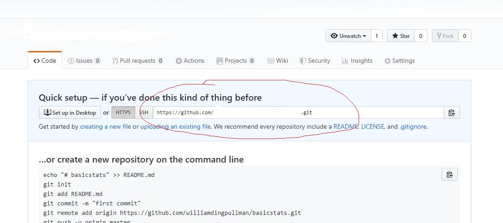
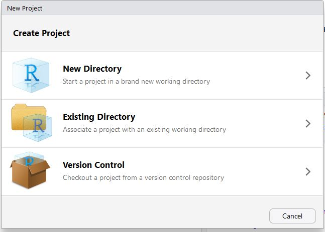
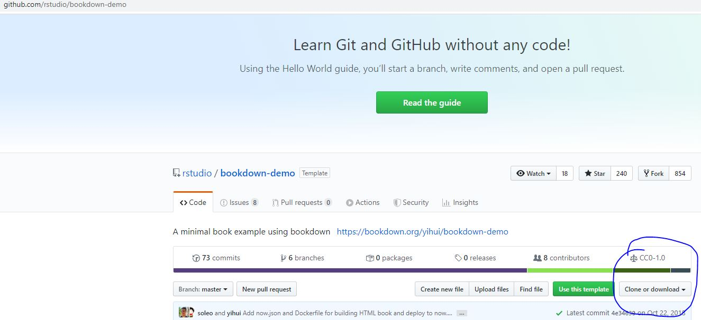
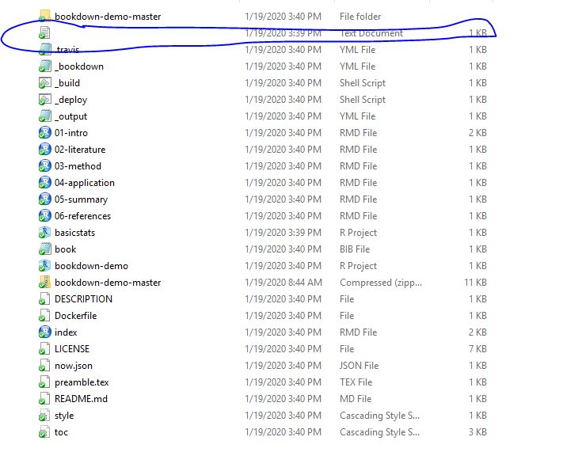
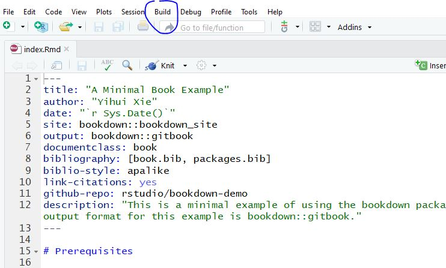

# How to link Github to RMarkdown

## Step 1: 

### Create a Github repository and copy the git address

 

## Step 2 

### Create a RMarkdown project through "Version Control" (paste the link; you need to set up Git in RMarkdown in advance.). It will generate a "XX.Rproj" file and a ".gitignore" file.

 

## Step 3

### Google "Bookdown-demo" and get the link to Github. Download all the files (You can type the address shown in the following pic as well.). Paste all the files into the same folder that contains the "XX.Rproj" file and the ".gitignore" file. However, you do not want to replace these two files. 

 

 

## Step 4

### Restart Rstudio, and open the "bookdown-demo.Rproj" project. Click "Build" menu, and then click "Build All."

## Step 5

### Add the line of output_dir: "docs" into the file of "_bookdown.yml."

## Step 6

### Edit the file of "_output.yml" to change the website links. 

## Step 7

### Replace all the .rmd files with your own ones. Rerun "Build" and "Build All."

## Step 8

### Create ".nojekyll" (0 BT file) either manually or through commands "touch .nojekell". (Refer to the next step regarding how to get to this command interface.)

## Step 8

### Click "More" then "Shell". Then, run the following three commands to upload all files to Github.

git add .
git commit -m "New file"
git push --all

