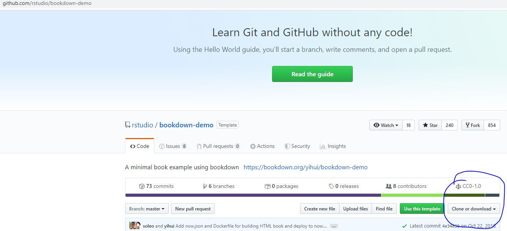
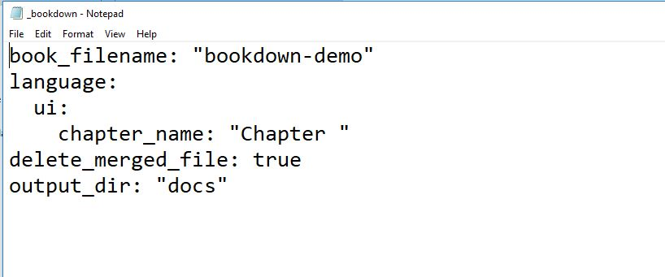
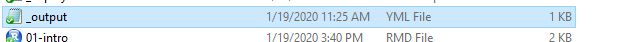
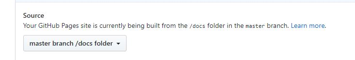

 

# How to Link Github to RMarkdown

 

## Step 1: 

### Create a Github repository and copy the ".git" address.

 

 

## Step 2 

### Create a RMarkdown project through "Version Control." Paste the link (you need to set up Git in RMarkdown in advance.). It will generate a "XX.Rproj" file and a ".gitignore" file.

 

 

## Step 3

### Google "Bookdown-demo" and get the link to Github. Download all the files (You can type the address shown in the following pic as well.). Paste all the files into the same folder that contains the "XX.Rproj" file and the ".gitignore" file. However, you do not want to replace these two files. 

 

 

 

 

## Step 4

### Restart Rstudio, and open the "bookdown-demo.Rproj" project. Click "Build" menu, and then click "Build All."

 

## Step 5

### Add the line of output_dir: "docs" into the file of "_bookdown.yml."

 

## Step 6 (Optional)

### Edit the file of "_output.yml" to change the website links. 

 

## Step 7

### Replace all the .rmd files with your own ones. Rerun "Build" and "Build All."

 

## Step 8

### Create ".nojekyll" (0 BT file) either manually or through commands "touch .nojekell". (Refer to the next step regarding how to get to this command interface.). You need to save this ".nojekell" file in the folder of "docs", where Github will read your html pages.

 

## Step 9

### Click "More" then "Shell". Then, run the following three commands to upload all files to Github.

git add .

git commit -m "New file"

git push --all

 

## Step 10

### Go to Github "Setting". In the section of "GitHub Pages", choose the "master branch/docs folder."

 

## Step 11

### Open "xxx.github.io/Your repository/". It should work, and you can see your website now.

 

## Step 12

### You can change your rmd files, and then rerun the "Build All" and the three commands mentioned above. You Github pages will reflect your updates (expect a 40-second delay).
